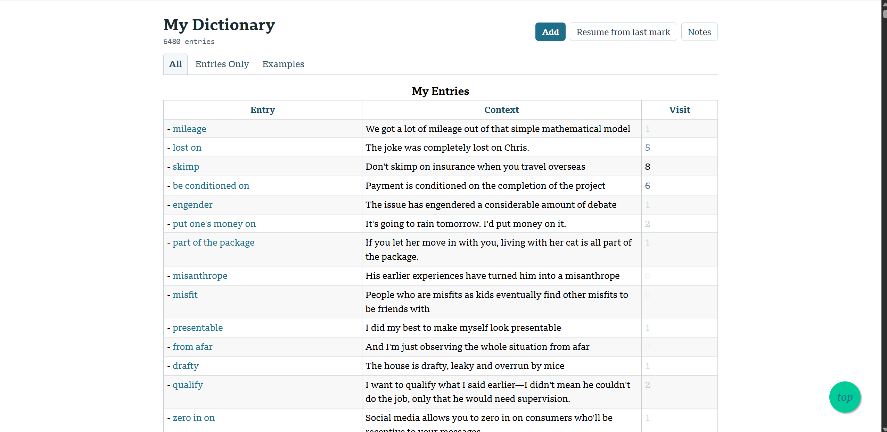
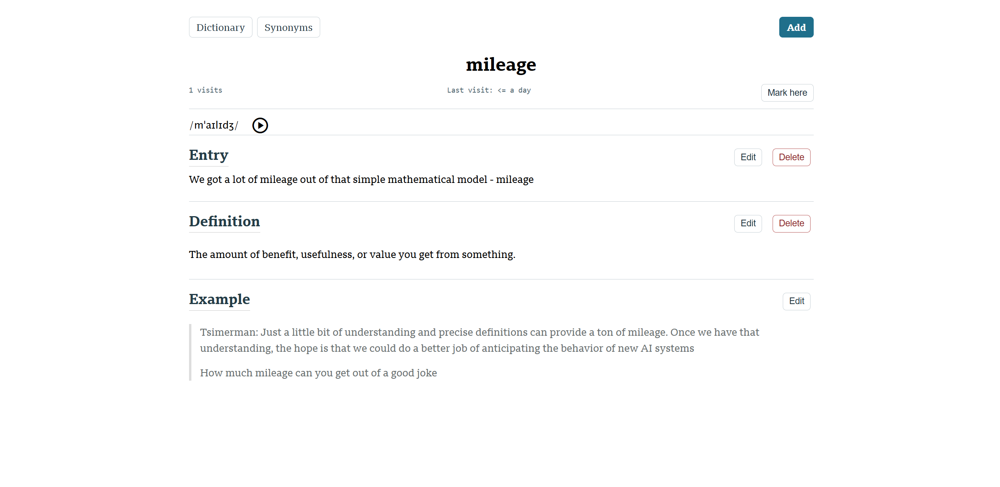

# My Dictionary（我的词典）

一个用于雅思（IELTS）备考的个人词汇网页应用，基于 FastAPI 和 SQLite 构建。你可以添加单词或短语、用 Markdown 撰写自己的释义、附上例句，并在之后进行复习——同时还内置了音标转写、词库同义词查询，以及一个 Markdown 笔记浏览器。

[English README](README.md)




## 功能特性

- **词条与释义** — 添加单词/短语，为每个词条附加一个或多个 Markdown 格式的释义和一个例句
- **音标转写** — 通过 [phonemizer](https://github.com/bootphon/phonemizer) 自动生成每个单词的国际音标（IPA）
- **同义词查询** — 从 Merriam-Webster Thesaurus API 获取同义词及词义解释
- **复习书签** — 标记当前复习进度，方便下次继续
- **访问记录** — 每个词条会记录访问次数和最近访问时间
- **多种视图** — 支持查看全部词条、仅词条列表、或带例句的词条列表
- **笔记模块** — 浏览并编辑一个 Markdown 笔记文件夹（例如雅思学习笔记），自动生成目录
- **Markdown 编辑** — 词条、释义、例句和笔记均使用 [EasyMDE](https://github.com/Ionaru/easy-markdown-editor) 进行编辑

## 技术栈

- [FastAPI](https://fastapi.tiangolo.com/) + [Jinja2](https://jinja.palletsprojects.com/) 模板
- [SQLAlchemy](https://www.sqlalchemy.org/) ORM，配合 SQLite 数据库
- [markdown2](https://github.com/trentm/python-markdown2) 用于渲染 Markdown 内容
- [phonemizer](https://github.com/bootphon/phonemizer) 用于音标转写
- 前端使用原生 JS 与 [EasyMDE](https://github.com/Ionaru/easy-markdown-editor)

## 安装与运行

需要 Python 3.12 及以上版本。

1. 安装依赖（使用 [uv](https://github.com/astral-sh/uv) 或 pip）：

   ```bash
   uv sync
   # 或者
   pip install -r requirements.txt
   ```

   音标转写功能还需要 `espeak-ng` 后端：

   ```bash
   sudo apt-get install espeak-ng
   ```

2. 复制示例配置文件并填入你自己的值：

   ```bash
   cp config.toml.example config.toml
   ```

   - `notes_folder` — 用于在 `/notes/` 下浏览的本地 Markdown 笔记文件夹路径
   - `mw_thesaurus_api_key` — 在 [Merriam-Webster Developer Center](https://dictionaryapi.com/) 免费申请的 API key（用于同义词功能）

3. 创建数据库表：

   ```bash
   python database.py create-table
   ```

4. 启动应用：

   ```bash
   uvicorn main:app --reload
   ```

   然后在浏览器中打开 `http://localhost:8000`。

## 说明

- 数据保存在本地的 `dictionary.db`（SQLite）文件中，未被 git 追踪。
