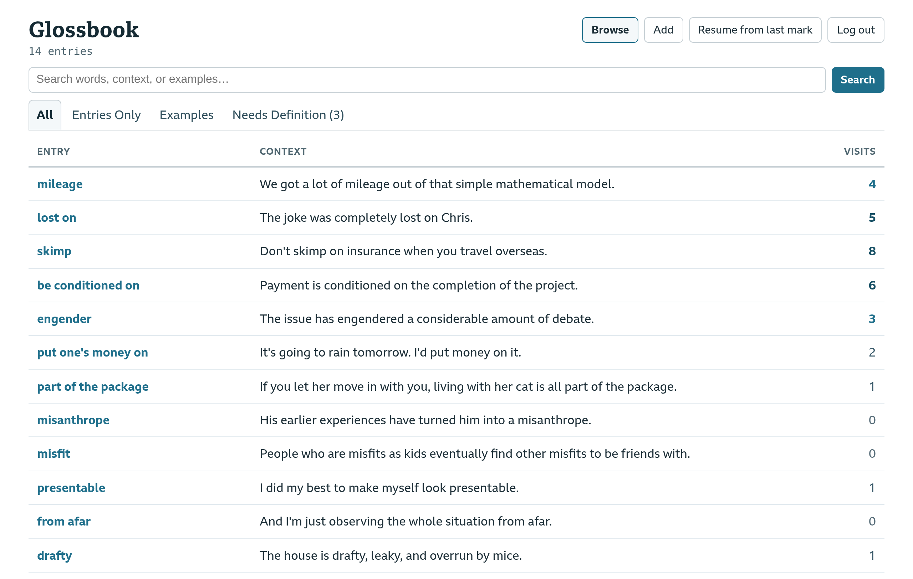

# My Dictionary（我的词典）

一个私有的个人长期英语词汇积累与主动回忆网页应用，基于 FastAPI 和 SQLite 构建。你可以添加单词或短语、用 Markdown 撰写自己的释义、附上真实语境和例句，并通过填空测验、音标转写与发音、关联词库同义词查询以及内置 Markdown 学习笔记浏览器不断巩固记忆。

[English README](README.md)




## 功能特性

- **词条与释义** — 添加单词/短语，用 Markdown 撰写个人释义，并附上语境和例句
- **填空主动回忆** — 首页内置轻松无压力的填空测验卡片，从自己保存的语境与例句中抽题
- **实时搜索** — 跨词条、语境与例句即时搜索并高亮匹配内容
- **音标转写与发音** — 通过 [phonemizer](https://github.com/bootphon/phonemizer) 自动生成国际音标（IPA），并支持发音播放
- **同义词查询** — 从 Merriam-Webster Thesaurus API 获取同义词及释义，并自动关联你词典中已收录的词条
- **复习书签** — 标记当前复习进度，方便下次从断点继续
- **访问记录** — 每个词条自动记录访问次数和最近访问时间
- **多种视图** — 支持查看全部词条、仅词条列表、或带例句的词条列表
- **学习笔记** — 浏览并编辑个人英语学习 Markdown 笔记文件夹，自动生成目录
- **Markdown 编辑** — 词条、释义、例句和笔记均使用 [EasyMDE](https://github.com/Ionaru/easy-markdown-editor) 进行编辑

## 技术栈

- [FastAPI](https://fastapi.tiangolo.com/) + [Jinja2](https://jinja.palletsprojects.com/) 模板
- [SQLAlchemy](https://www.sqlalchemy.org/) ORM，配合 SQLite 数据库
- [markdown2](https://github.com/trentm/python-markdown2) 用于渲染 Markdown 内容
- [phonemizer](https://github.com/bootphon/phonemizer) 用于音标转写
- 前端使用原生 JS 与 [EasyMDE](https://github.com/Ionaru/easy-markdown-editor)

## 安装与运行

需要 Python 3.12 及以上版本。

1. 安装依赖（使用 [uv](https://github.com/astral-sh/uv) 或 pip）：

   ```bash
   uv sync
   # 或者
   pip install -r requirements.txt
   ```

   音标转写功能还需要 `espeak-ng` 后端：

   ```bash
   sudo apt-get install espeak-ng
   ```

2. 复制示例配置文件并填入你自己的值：

   ```bash
   cp config.toml.example config.toml
   ```

   - `notes_folder` — 用于在 `/notes/` 下浏览的本地 Markdown 笔记文件夹路径
   - `mw_thesaurus_api_key` — 在 [Merriam-Webster Developer Center](https://dictionaryapi.com/) 免费申请的 API key（用于同义词功能）

3. 配置个人登录账号，生成 Argon2 密码哈希和随机会话密钥：

   ```bash
   uv run python -c "from pwdlib import PasswordHash; print(PasswordHash.recommended().hash(input('Password: ')))"
   uv run python -c "import secrets; print(secrets.token_urlsafe(48))"
   ```

   将结果填入 `config.toml` 的 `[auth]` 配置段：

   ```toml
   [auth]
   admin_username = "admin"
   admin_password_hash = "$argon2id$..."
   session_secret = "the-random-session-secret"
   https_only = true
   ```

   生产环境默认使用仅限 HTTPS 的安全会话 Cookie（有效期 30 天）。如果在受信任的局域网中通过 HTTP 测试，可临时设置 `https_only = false`，但在公网部署时请务必保持为 `true`。也支持使用 `DICTIONARY_*` 环境变量覆盖对应配置。

4. 创建数据库表：

   ```bash
   python database.py create-table
   ```

5. 启动应用：

   ```bash
   uvicorn main:app --reload
   ```

   然后在浏览器中打开 `http://localhost:8000`。

## 访问控制

- 整个应用默认私有：所有词条页面、测验、同义词、书签、笔记和修改接口均需在 `/login` 登录后访问。
- 仅 `/login` 和 `/static/*` 静态资源在未登录时可访问。
- 会话使用 `HttpOnly`、`SameSite=Lax` Cookie（开启 `https_only` 时附带 `Secure`），有效期 30 天。
- 所有状态修改请求均需携带有效的 CSRF Token。
- 已禁用 FastAPI 的 `/docs`、`/redoc` 和 `/openapi.json` 接口。

## 说明

- 数据保存在本地的 `dictionary.db`（SQLite）文件中，未被 git 追踪。
